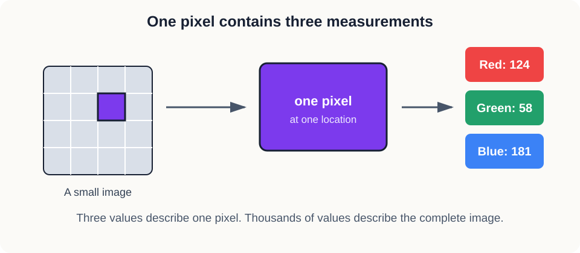
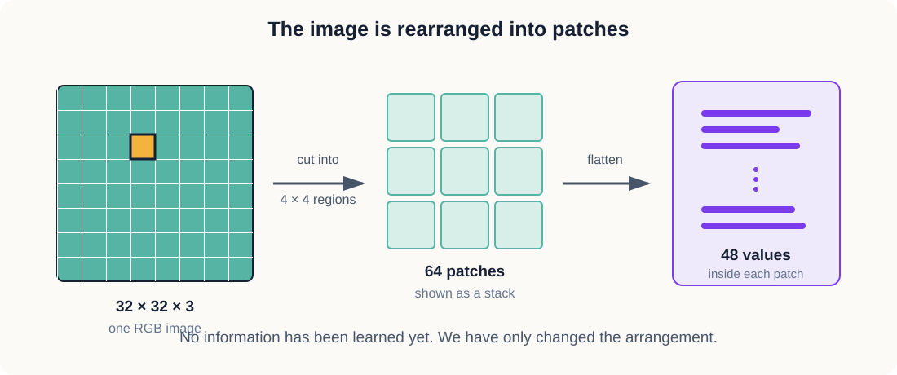
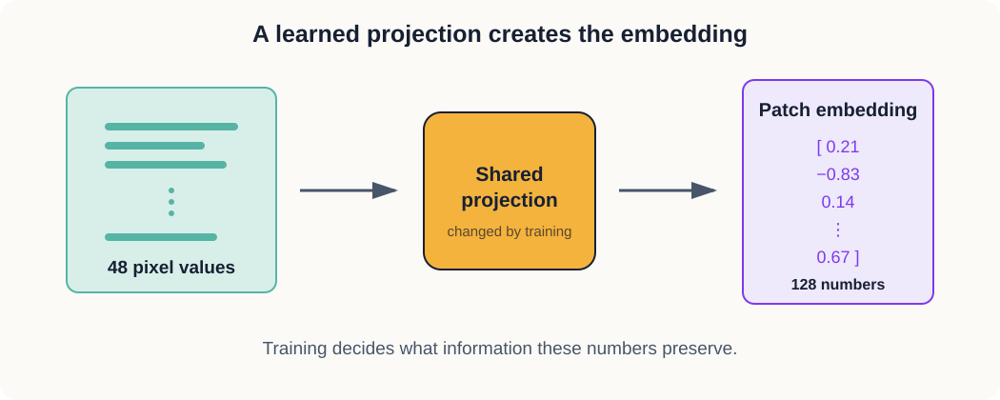

# 1. From Pixels to Embeddings

Before we build a JEPA, we need to understand what the model sees.

When we look at an image, we see a bird, a car, or a horse. The computer begins with numbers. The
distance between those two descriptions is where representation learning begins.

## One pixel contains three numbers

A colour image normally uses three channels: red, green, and blue. One pixel can therefore be
written as:

```text
[red, green, blue]
```

For example, `[255, 0, 0]` describes a bright red pixel when channel values range from 0 to 255.
The three numbers belong to one pixel. An image contains many pixels.

A 32 by 32 image contains:

```text
32 × 32 = 1,024 pixels
```

Each pixel has three channel values, so the complete image contains:

```text
32 × 32 × 3 = 3,072 values
```

This is why an RGB image can contain thousands of numbers even though RGB has only three channels.



*Figure 1.1 — RGB describes the three measurements stored at each pixel, not the total number of
values in an image.*

## Dividing the image into patches

Our first model will not treat the whole image as one long list. It will divide the image into
small squares called patches.

We use patches that are 4 pixels wide and 4 pixels high. A 32 by 32 image therefore has eight
patches across and eight patches down:

```text
32 ÷ 4 = 8

8 × 8 = 64 patches
```

One patch contains 4 by 4 pixels. Each pixel still has three colour channels:

```text
4 × 4 × 3 = 48 values
```

Nothing has been learned yet. We have only rearranged the original image.



*Figure 1.2 — Patchifying changes the arrangement of the values. It does not yet create meaning.*

```text
Image:   3 × 32 × 32
                 ↓ divide into squares
Patches: 64 × 48
```

The first shape says that the image has three channels, a height of 32, and a width of 32. The
second says that we now have 64 patches and each patch contains 48 values.

## Turning a patch into an embedding

We next pass every 48-number patch through the same small neural-network layer. The layer produces
128 numbers:

```text
48 pixel values → projection → 128 numbers
```

The output is an embedding for that patch. Because the image contains 64 patches, the model
produces 64 embeddings:

```text
64 patches × 128 embedding dimensions
```

The number 128 does not mean that the image suddenly has 128 colour channels. RGB still has three
channels. The 128 numbers are features created inside the model.



*Figure 1.3 — The same projection is applied to every patch. Training changes this projection and
therefore changes what the embedding preserves.*

## Where meaning comes from

At the beginning, the projection contains random values. Its output is a vector, but the vector is
not yet useful. We should not assume that it represents shape, colour, or object identity simply
because we call it an embedding.

Meaning comes from training.

The training task changes the projection so that some outputs become useful for solving that task.
If the task rewards the model for recognising structure, its embeddings may begin to carry
information about structure. If the task rewards exact pixel reconstruction, its embeddings may
preserve fine visual detail instead.

This is the question behind the later comparison. We will give two models different prediction
targets and observe what information their embeddings preserve.

## Our first experiment

The first program creates a synthetic 32 by 32 colour image. It then:

1. divides the image into 64 patches;
2. flattens each patch into 48 values;
3. projects each patch into 128 dimensions;
4. displays the image, one patch, and all 64 output vectors.

Run it from the project root:

```bash
python 01-image-embeddings/inspect_embeddings.py
```

The program saves a figure as `artifacts/01-image-embeddings.png`.

## What this experiment teaches us

This experiment does not train a JEPA. It establishes the objects that the JEPA will use.

We now know the difference between:

- a channel, which stores one kind of pixel measurement;
- a patch, which is a small region cut from an image;
- an embedding dimension, which is one coordinate in a learned internal representation;
- an embedding, which is the complete vector produced for a patch.

In the next experiment, we will train an autoencoder to reconstruct pixels. That will give us our
first example of a training objective shaping what an encoder learns.
