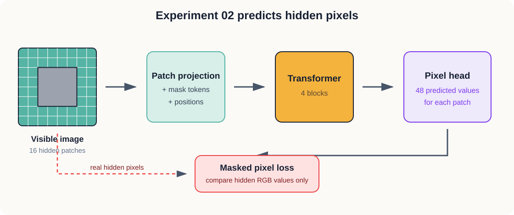

# 2. Reconstructing Missing Pixels

We now give the model its first learning problem.

We hide the centre of an image and ask the model to fill it in. Its answer is judged one RGB value
at a time. This becomes our baseline because JEPA will later receive a similar visible context while
being asked to predict a different kind of target.

## The question

What does a model learn when its job is to reproduce the exact pixels in a region it cannot see?

## Our prediction

We expect the training loss to fall. The model should learn common colours and broad shapes, but
some reconstructions may look blurry or generic.

The reason is simple. The visible border does not always tell us the exact contents of the centre.
A patch of blue sky might continue behind the mask, but a hidden animal could have several possible
poses. The loss still demands one exact RGB answer.

## What we hide

Every CIFAR-10 image contains an 8 by 8 grid of patches. We hide a 4 by 4 block in the centre:

```text
64 patches in the image
16 hidden patches
48 RGB values in each patch

16 × 48 = 768 hidden values to predict
```

This means the model sees 75 percent of the image and predicts the remaining 25 percent.

## The architecture



*Figure 2.1 — The model is trained by comparing its predicted RGB values with the real values in
the hidden patches.*

The visible and hidden patches follow the same sequence of positions. Visible patches are converted
from 48 pixel values into 128-number tokens. Hidden positions receive a learned mask token instead.
Position embeddings tell the model where every token belongs.

Four transformer blocks let information move between the patch positions. A final linear layer
maps every 128-number output back to 48 predicted RGB values.

## The loss

The model produces a prediction for every patch, but we calculate error only at hidden positions.
For those positions, we use mean squared error:

```text
error = average((predicted pixel value − real pixel value)²)
```

A large mistake is penalised more heavily because it is squared. Training changes the patch
projection, mask token, position embeddings, transformer, and pixel head to reduce this error.

## What remains fixed

Our first run uses:

| Choice | Value |
| --- | ---: |
| Image size | 32 × 32 |
| Patch size | 4 × 4 |
| Patches | 64 |
| Hidden patches | 16 |
| Token dimension | 128 |
| Transformer blocks | 4 |
| Attention heads | 4 |
| Training images | 10,000 |
| Batch size | 64 |
| Epochs | 10 |

These choices are small enough for repeated experiments. More importantly, we will reuse the key
dimensions in the JEPA so that the prediction target becomes the main difference.

## Running the experiment

The notebook is the main lesson:

```bash
jupyter lab 02-autoencoder/experiment.ipynb
```

Select the `Python (JEPA Experiments)` kernel and run the cells in order. The notebook first shows
the mask, prints the model shapes, measures the untrained loss, trains the model, plots the loss,
and finally displays the original, visible, and reconstructed images together.

The same training can run without Jupyter:

```bash
python 02-autoencoder/train.py --epochs 10 --samples 10000
```

## What to observe

We should keep description separate from explanation. First record:

- how quickly the loss falls;
- whether it continues falling at the end;
- whether reconstructed colours match their surroundings;
- whether object boundaries continue through the hidden region;
- whether the result is sharp, blurry, or repetitive;
- which kinds of images produce the clearest failures.

Only after recording those observations should we ask what caused them.

## What this experiment will not prove

A low pixel loss does not prove that the internal representation understands object identity. It
only shows that the model became better at the pixel prediction task.

That distinction leads to our next experiment. We will keep the idea of visible and hidden regions,
but replace the 768 hidden RGB targets with learned target embeddings. Then we can ask whether the
change in target changes what the encoder learns.

