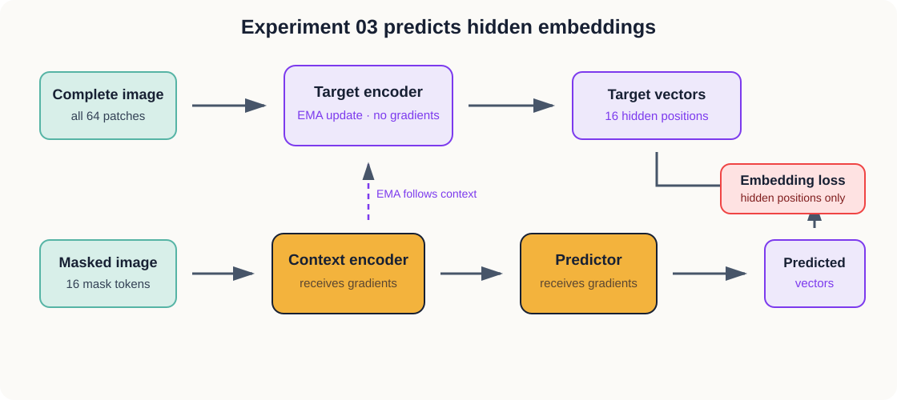

# 3. Predicting Hidden Embeddings

Experiment 02 predicted the RGB values inside a hidden region. We now change the target.

The new model predicts vectors produced by another encoder. It is never asked to reconstruct a
pixel. This is our first small Joint-Embedding Predictive Architecture.

## The question

Can a model learn to predict the representation of a hidden image region without predicting its
pixels?

## The architecture



*Figure 3.1 — The context encoder and predictor learn through gradients. The target encoder receives
no gradients and follows the context encoder through an exponential moving average.*

The target encoder sees the complete image. The context encoder sees the same central mask used in
Experiment 02. A predictor turns context outputs into estimates of the target encoder’s vectors at
the 16 hidden positions.

The target encoder begins as a copy of the context encoder. After every optimizer step, its
parameters move a small distance toward the context encoder:

```text
target ← 0.99 × target + 0.01 × context
```

This makes the target change more slowly than the network being trained to predict it.

## What remained fixed

| Choice | Value |
| --- | ---: |
| Training images | 10,000 |
| Image size | 32 × 32 |
| Patch size | 4 × 4 |
| Patches | 64 |
| Hidden patches | 16 |
| Embedding dimension | 128 |
| Context encoder blocks | 4 |
| Predictor blocks | 2 |
| Epochs | 10 |

The central change is the prediction target: 48 RGB values per hidden patch became a 128-number
target-encoder vector.

## What happened

The untrained predictor had a hidden-patch loss of `0.014584` and cosine similarity of `0.0666`.
Its best training fit occurred at epoch 3:

| Point | Embedding loss | Cosine similarity |
| --- | ---: | ---: |
| Before training | 0.014584 | 0.0666 |
| Epoch 1 | 0.000605 | 0.9613 |
| Epoch 3 | 0.000090 | 0.9942 |
| Epoch 10 | 0.000355 | 0.9773 |

The model learned to match its target very quickly. The improvement did not continue through all
ten epochs. After epoch 3, the loss rose and cosine similarity fell. Because the target encoder is
moving throughout training, this reversal could mean the predictor stopped keeping pace with it.

For one displayed training image, cosine similarity for every hidden patch was between `0.990` and
`0.994`. The predicted and target heatmaps looked extremely similar.

## The warning in the heatmap

Matching heatmaps are evidence that the predictor learned the target. They are not yet evidence
that the target is useful.

The rows inside the target heatmap looked almost identical across the 16 hidden positions. If many
patches and images receive nearly the same vector, the predictor has an easy solution: predict that
same vector everywhere. This failure is called representation collapse.

The current heatmap is a warning rather than proof of collapse because it shows one image. We added
four measurements to the notebook:

- mean standard deviation across embedding features;
- similarity between patches from the same image;
- similarity between different images;
- effective rank of the representation matrix.

Together, these measurements ask whether the target encoder continues to use its 128 dimensions to
distinguish different inputs.

## What we learned

The model can optimize an embedding-prediction objective without reconstructing pixels. That
confirms the basic JEPA training mechanism.

The experiment also exposed a more important lesson: low prediction loss is not enough. We need to
test two separate properties:

1. **Diversity:** Do different inputs receive meaningfully different representations?
2. **Usefulness:** Can those representations support a task such as object classification?

The diversity diagnostics address the first question. A later linear probe will address the
second. Until those checks pass, we should describe this run as successful target matching with a
possible collapse warning, rather than evidence that the model understands the images.

