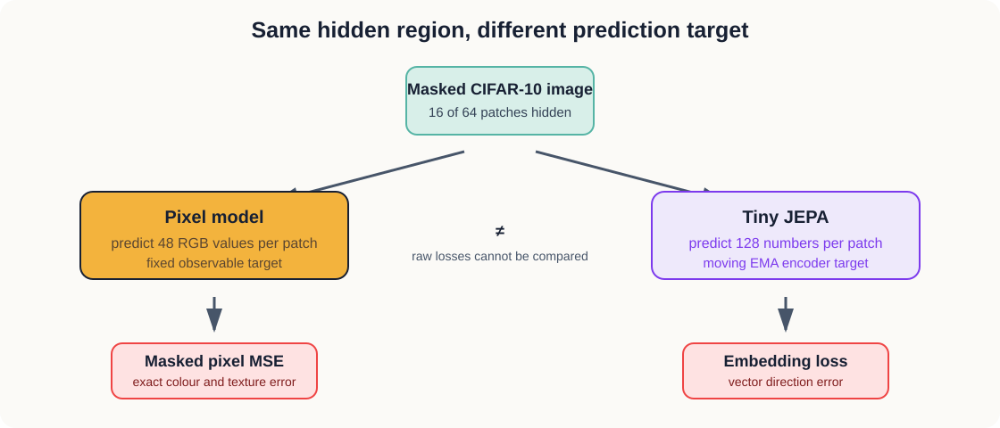

# 4. Pixels Versus Embeddings

We now place the two prediction targets side by side.

Both models receive the same CIFAR-10 images. Both lose the same central region. Both use
four-block encoders with 128-number patch tokens. The difference is what counts as the correct
answer.

## The question

What changes when a model predicts a hidden representation instead of hidden pixels?



*Figure 4.1 — The input and hidden region are shared. The prediction targets and meanings of the
losses are different.*

## What we hold fixed

| Choice | Both models use |
| --- | ---: |
| Training images | 10,000 |
| Held-out test images | 1,000 |
| Image size | 32 × 32 |
| Patch size | 4 × 4 |
| Hidden region | central 16 patches |
| Encoder token dimension | 128 |
| Encoder blocks | 4 |
| Attention heads | 4 |
| Batch size | 64 |
| Training epochs | 5 |
| Learning rate | 0.0003 |

JEPA also needs a two-block predictor. Its complete trainable model is therefore larger. The
notebook prints both parameter counts so this limitation remains visible.

## Why the raw losses cannot be compared

The pixel model measures squared error between RGB values. JEPA measures squared error between
normalized vectors. A value of `0.03` in one objective does not mean the same thing as `0.03` in the
other.

We instead divide each epoch loss by that model’s loss before training:

```text
relative loss = current loss ÷ initial loss
```

This tells us how much of each model’s starting error remains. It does not pretend that the two
targets have acquired the same units.

## Four comparisons

### 1. Relative learning progress

How rapidly does each model reduce its own error under the same training budget?

### 2. Held-out prediction

Does each model also predict its target on 1,000 images that were not used for training? Each result
is interpreted within its own objective.

### 3. Representation diversity

We give both encoders complete test images and measure:

- feature standard deviation;
- similarity among patches inside an image;
- similarity across different images;
- effective representation rank out of 128.

A collapsed representation has little variation, very high similarity across unrelated inputs, and
low effective rank.

### 4. Nearest-neighbour label agreement

We average the 64 patch vectors into one vector per image. For each test image, we find its closest
other image and ask whether their CIFAR-10 labels match.

The models never see labels during training. Labels appear only in this evaluation. With ten
balanced categories, chance agreement is roughly 10 percent. Higher agreement suggests that nearby
representations share some semantic structure.

This is an early diagnostic. Experiment 05 will use a trained linear probe for a more direct test.

## Running the experiment

```bash
jupyter lab 04-pixel-vs-embedding/experiment.ipynb
```

Select `Python (JEPA Experiments)` and run the notebook in order. It trains both models, so it will
take longer than the earlier notebooks.

## What happened

### Prediction fit

| Model | Initial loss | Epoch 5 loss | Starting error remaining |
| --- | ---: | ---: | ---: |
| Pixel target | 0.683755 | 0.039632 | 5.8% |
| Embedding target | 0.017208 | 0.000197 | 1.1% |

JEPA reached its best value, `0.000145`, at epoch 3 and then weakened slightly. This repeated the
late reversal from Experiment 03. It matched its moving target faster than the pixel model reduced
its own error.

The relative comparison has limits. Initial loss was measured on one batch, epoch loss was averaged
over the training subset, dropout was active during training, and JEPA’s EMA target changed after
every update.

### Held-out prediction

| Measurement on 1,000 test images | Result |
| --- | ---: |
| Pixel MSE | 0.034667 |
| JEPA embedding loss | 0.000222 |
| JEPA cosine similarity | 0.9858 |

Both models predicted their own targets on unseen images. Pixel MSE and embedding loss remain
different measurements and cannot be compared directly.

### Representation diversity

| Measurement | Pixel model | JEPA |
| --- | ---: | ---: |
| Feature standard deviation | 0.0155 | 0.0393 |
| Similarity among patches in one image | 0.9973 | 0.9925 |
| Similarity across different images | 0.9702 | 0.7812 |
| Effective rank out of 128 | 38.06 | 21.62 |

JEPA separated different images more strongly: its across-image similarity was much lower and its
feature variation was higher. Its effective rank was also lower, so that variation occupied fewer
independent directions. The pixel representation used more directions but placed different images
closer together. Patches inside the same image were extremely similar for both models.

The JEPA representation did not completely collapse. Its different-image similarity was well below
one, and its effective rank was above one. It nevertheless used only a relatively small part of its
128-dimensional space.

### Nearest-neighbour label agreement

| Reference or model | Agreement |
| --- | ---: |
| Random reference | about 10.0% |
| Pixel representation | 18.3% |
| JEPA representation | 16.5% |

Both representations contained some class-related structure without seeing labels during training.
The pixel model was 1.8 percentage points higher in this run. One seed, 1,000 test images, and a
nearest-neighbour measurement are not enough to treat that small difference as a general result.

## What we learned

Changing the prediction target changed the geometry of the representation. JEPA distinguished whole
images more strongly but concentrated the variation into fewer directions. The pixel model used
more directions and achieved slightly higher nearest-neighbour class agreement.

Our prediction that JEPA would immediately produce the more semantic representation was not
supported. There is no clear winner yet. Experiment 05 will train linear probes on frozen encoders
and repeat the evaluation under controlled conditions.
