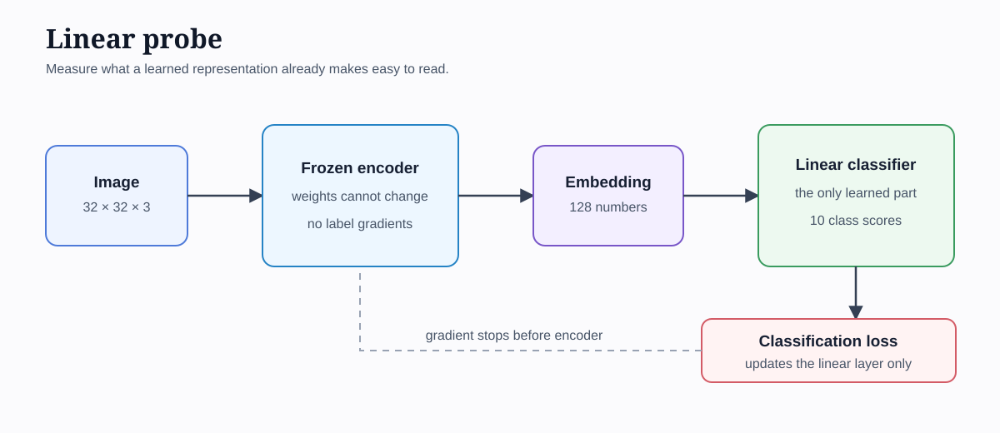

# 5. Asking What an Embedding Knows

The previous experiment found a weak sign of class structure. Images with the same label were
nearest neighbours more often than chance, but that test depended on the exact geometry of the
embedding space. We now ask a more direct question:

> Can a simple classifier recover an image's class from a frozen representation?



*Figure 5.1 — The encoder produces one vector per image. Its weights stay frozen. Only the small
linear classifier learns from CIFAR-10 labels.*

## What a linear probe is

We first train an encoder without labels. We then stop the encoder from learning and use it to turn
each image into one vector. A linear layer receives that vector and produces ten class scores:

```text
image → frozen encoder → 128-number vector → linear layer → 10 class scores
```

The linear layer can draw flat boundaries through the representation space. If it classifies images
well, the encoder has already arranged useful class information so that a simple boundary can read
it. If it performs poorly, class information may be absent, tangled together, or require a more
complex reader.

The probe does not prove that an embedding understands an object. It gives us one controlled and
repeatable measurement of how accessible the class information is.

## The controlled comparison

We retrain the pixel model and JEPA with the same settings used in Experiment 04. After this
self-supervised stage, both encoders are frozen. We then:

1. give each encoder complete, unmasked images;
2. average its 64 patch vectors into one 128-number image vector;
3. standardize each feature using training-set statistics;
4. train a single linear layer from 128 inputs to ten CIFAR-10 classes;
5. evaluate it on held-out test images.

The labels never update either encoder. Gradients stop at the linear layer.

## Why repeat the probe

A probe starts with random weights and sees randomly ordered batches. One run can therefore be
slightly fortunate or unfortunate. We train five probes for each frozen representation and report
the mean accuracy and its standard deviation.

This repetition measures variation in the probe stage. It does not measure every source of
uncertainty because the self-supervised models are still trained once. Repeating the complete
pretraining process would be a stronger and more expensive experiment.

## Three reference points

The result is easier to interpret beside three references:

- **Chance:** CIFAR-10 has ten balanced classes, so chance accuracy is about 10 percent.
- **Raw pixels:** a linear classifier sees the flattened RGB values directly.
- **Learned representations:** linear classifiers see frozen pixel-model or JEPA vectors.

The raw-pixel probe tells us whether either encoder offers a useful arrangement beyond a direct
linear reading of the input.

## Running the experiment

```bash
jupyter lab 05-test-embeddings/experiment.ipynb
```

Select `Python (JEPA Experiments)` and run the notebook in order. Record the measured accuracies in
the final notebook section before drawing a conclusion.

## What remains uncertain

This experiment uses one pretraining seed, a limited training subset, mean pooling, and one fixed
probe recipe. Its conclusion applies to these particular representations and settings. Later work
can repeat pretraining, tune the probe on a validation set, or test which individual visual
properties are encoded.

## What happened

| Input to the linear probe | Mean test accuracy | Standard deviation |
| --- | ---: | ---: |
| Raw pixels | 31.3% | 1.38% |
| Pixel-model representation | **35.3%** | 0.34% |
| JEPA representation | 31.6% | 0.74% |

All three probes exceeded the roughly 10 percent chance level. The pixel-model representation was
4.0 percentage points above raw pixels and 3.7 points above JEPA. JEPA was only 0.3 points above raw
pixels, less than the variation among its probe runs.

The result also changes how we interpret the training loss. JEPA reached a loss of `0.000067` after
four epochs, yet that close target match did not produce the best linear probe. Predicting the EMA
target accurately was therefore an incomplete measure of representation quality.

This agrees with the weaker nearest-neighbour result from Experiment 04. Two different evaluations
now point in the same direction: our current JEPA representation contains some class information,
but the pixel reconstruction representation makes more of it linearly accessible.

## What we learned

A low embedding-prediction loss does not establish that useful semantic structure has emerged. A
separate downstream measurement is necessary.

For this run, the pixel reconstruction representation made CIFAR-10 class information easiest for
a linear classifier to read. We will keep this disappointing result. It motivates a focused
follow-up that moves the hidden block and explicitly discourages low-variance features.

## Follow-up: testing our collapse explanation

Experiment 05B compared three JEPAs trained together:

| JEPA condition | Probe accuracy | Standard deviation |
| --- | ---: | ---: |
| Central mask | **29.6%** | 0.74% |
| Random mask | 28.0% | 0.64% |
| Random mask plus variance | 28.1% | 0.65% |

The moving block made prediction harder and separated different images more strongly. Across-image
cosine similarity fell from `0.7106` with the central mask to `0.4922`, but probe accuracy also fell
by 1.6 percentage points. The fixed centre was therefore not a sufficient explanation for the weak
semantic result.

The variance penalty had an even larger geometric effect. It raised normalized feature standard
deviation from `0.0433` to `0.0800`, reduced across-image similarity to `0.1590`, and raised
effective rank from `16.03` to `18.22`. Nevertheless, its probe reached only `28.1%`.

This is an important negative result. We successfully made the embeddings more varied without
making class information easier to read. Variation can describe colour, position, texture, noise,
or other distinctions that do not align with object identity.

The central-mask control also varied across pretraining runs: `29.6%` here compared with `31.6%` in
the first linear-probe experiment. Repeating probe seeds measures only classifier variation. Future
strong comparisons should repeat the complete self-supervised training process.

Our first collapse explanation was incomplete. Before adding more regularizers, the next experiment
will measure which image changes dominate the learned representation. That is the subject of
Chapter 6: invariance.
