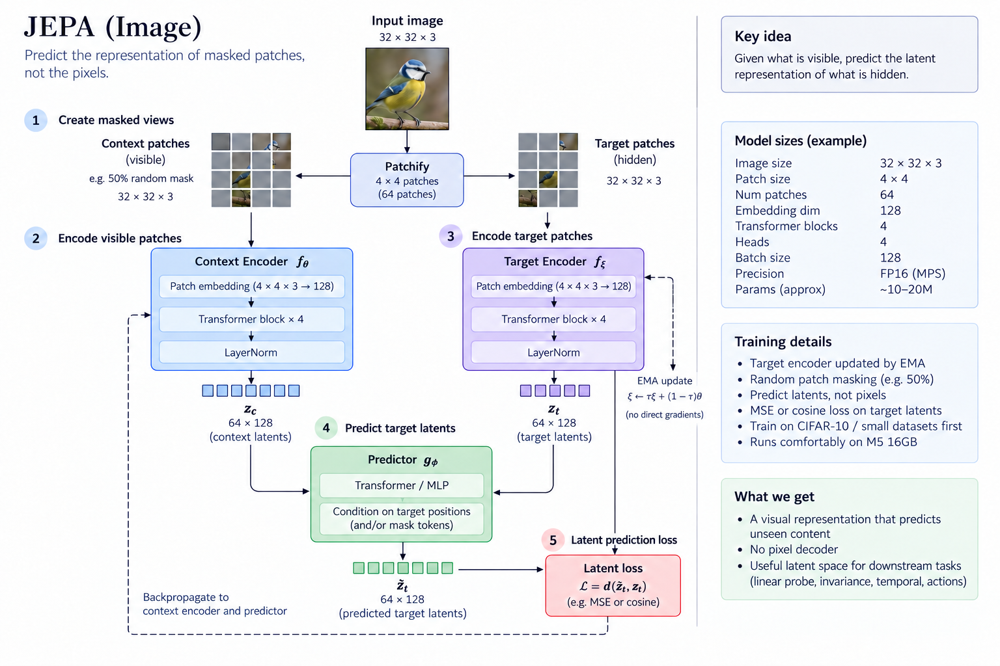

# Understanding JEPA by Building One

This is a practical book about learning what a Joint-Embedding Predictive Architecture does by
building one piece at a time.

We will not begin with a large model or a collection of equations. We will begin with one small
image and one simple question:

> Can a model learn what matters in an image by predicting an internal representation of a hidden
> part?

*Figure 0.1 — The complete idea in one view: create visible and hidden regions, encode them, predict
the hidden representations from the visible context, and train by comparing vectors rather than
pixels. The settings printed in this overview are illustrative; individual experiments use the
configurations recorded in their chapters.*

This figure is our map of the destination. The early chapters deliberately isolate one part at a
time: pixels and patches, pixel reconstruction, the two encoders, the predictor, and the latent
loss. We will return to the complete diagram as those pieces become familiar.

Every chapter introduces one new idea. We will inspect the data, print tensor shapes, draw the
architecture, train a small model, and study what it learned. When an experiment fails, that failure
will become part of the explanation.

Before Chapter 1, [Experiment 00](../00-prepare-data/README.md) acquires and validates the shared
CIFAR-10 dataset. The remaining image experiments use that prepared data.

## How each chapter works

Each chapter follows the same path:

1. **The question** — the one thing we want to understand.
2. **The intuition** — the idea in ordinary language.
3. **The experiment** — what we change and what we keep fixed.
4. **The code** — how the idea becomes tensors and operations.
5. **The evidence** — images, loss curves, measurements, and comparisons.
6. **What we learned** — what the evidence supports.
7. **What remains uncertain** — what the experiment did not prove.

## Chapters

1. [From pixels to embeddings](01-from-pixels-to-embeddings.md)
2. [Reconstructing missing pixels](02-reconstructing-missing-pixels.md)
3. [Predicting hidden embeddings](03-predicting-hidden-embeddings.md)
4. [Pixels versus embeddings](04-pixels-versus-embeddings.md)
5. Asking what an embedding knows
6. Learning what to ignore
7. Predicting the next moment
8. Predicting the result of an action
9. What our experiments taught us about JEPA

## Supporting material

- [Glossary](glossary.md)
- [Dataset record](dataset.md)
- [Experiment record template](experiment-template.md)
- Figures generated by the code are stored in `artifacts/` at the project root.
